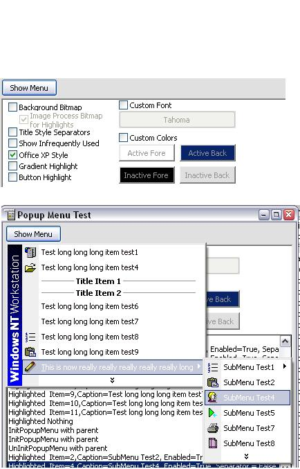



## Popup Menus

### Description

Api popupmenus, supporting custom colors/fonts Office XP style, images, highlight, init/uninitpopupmenu events, infrequently used, sidebars, per-item visibility, title-style headers for separators, and more.
 
### More Info
 

             |
---                |---
**Submitted On**   |2004-07-08 17:25:20
**By**             |[selftaught](https://github.com/Planet-Source-Code/PSCIndex/blob/master/ByAuthor/selftaught.md)
**Level**          |Intermediate
**User Rating**    |4.5 (45 globes from 10 users)
**Compatibility**  |VB 6\.0
**Category**       |[Graphics](https://github.com/Planet-Source-Code/PSCIndex/blob/master/ByCategory/graphics__1-46.md)
**World**          |[Visual Basic](https://github.com/Planet-Source-Code/PSCIndex/blob/master/ByWorld/visual-basic.md)
**Archive File**   |[Popup\_Menu176750782004\.zip](https://github.com/Planet-Source-Code/selftaught-popup-menus__1-54828/archive/master.zip)

### API Declarations

one or two

